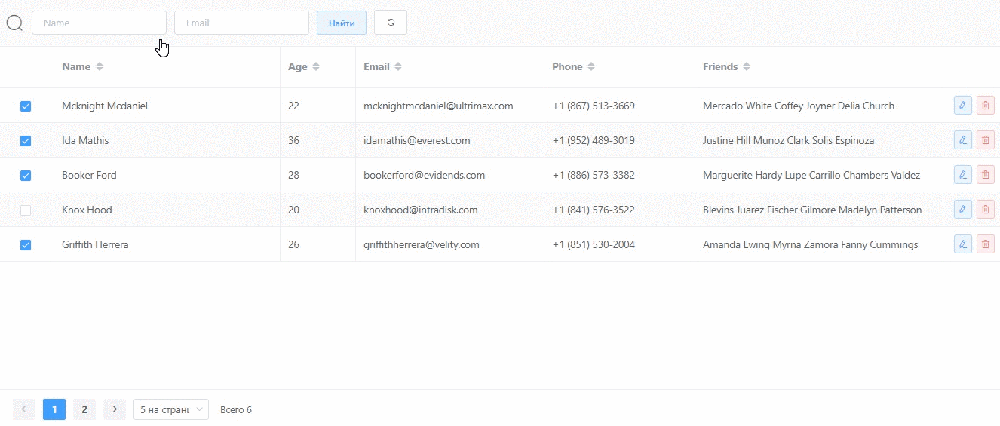

# ElGrid

A Vue.js component which combines form, table, pagination components in Element UI.



## Project setup

```
npm install
```

### Compiles and hot-reloads for development

```
npm run serve
```

### Compiles and minifies for production

```
npm run build
```

### Compiles and minifies as package

```
npm run lib:build
```

## Roadmap

- Support i18n
- Examples
- API docs
